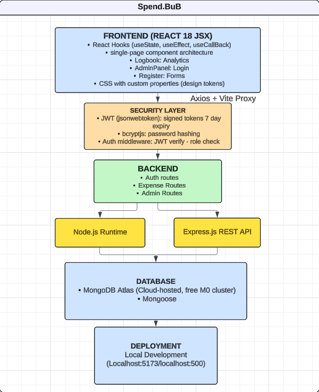

1. Project Title: Spend.bub

2. Project Summary:
A common and leading challenge often found in today's growing economy is managing personal finances as people often lose track of where they spend their money. This is a real concern as we overlook the rapid accumulation of everyday spending across different categories. Which is why this single-page web application: Spend.Bub solves this by providing a clean yet cute, fast interface to log, organise, and review users' spending in real time. Users can add expenses with its title, category (e.g. shopping, food & dining, transport etc) and an optional description. They can edit or delete any entry, filter the logbook by category and date range, and switch to an analytics view to see their spending visualisation by category and monthly expenditure trends. 

3. Technical stack:

4. Feature List:
- Single-page application: can dynamically switch between Logbook and Analytics view without any page reloads
- add expense with its own section of title, category, amount, date, and description
- Edit any existing expense via pre-filled modal form
- Delete expense with confirmation dialog to prevent errors
- logbook expense filter by category and date range 
- Clear filters button that appears only when filters are active
- Summary expenses statistic cards
- Custom category icons 
- responsive layout: adapts to mobile and tablet sizes
- accessibility: contrast styling with abtract text colour and background, alt text for readablity

5. Folder Structure
BACKEND:
server/index.js: server entry point, connects to MongoDB Atlas
server/models/Expense.js: Defines mongoose schema for expense data structure
server/routes/expenses.js: all CRUD routes
server/.env: Environmental variables - MongoDB URI and port

FRONTEND:
client/index.html: single HTML file 
client/vite.config.js: Vite config, proxies / api calls to Express
client/src/App.jsx: Root component, layout, navigation, toast state
client/src/api.js: All Axios API calls to backend
client/src/constants.js: categories, colours, icons, and formatters
client/src/index.css: all styles like design tokens, layout and components

REACT:
Logbook.jsx: Expense table with filters, edit, delete, and sidebar totals
Analytics.jsx: CHarts and expenses summary statistics
ExpenseForm.jsx: add and edit modal form with validation
ConfirmDialog.jsx: Delete confirmation popup
CategoryBadge.jsx: Categroy image icons with colour

5. Challenges
One of the most challenging part of this project was connecting the frontend to MongoDB Atlas as I was not too familiar on how it worked. This pushed me onto researching and figuring out how to integrate and connect my MongoDB Atlas string with a series of trials. I also faced subtle bugs involving the analytics page where it was not returning any expense data collected into the MongoDB database despite the connection string being correctly pasted. However, after some tests and bug searching, I was able to find the mismatch between the database name in the connection string as it was still stuck in the default "test" name. 

